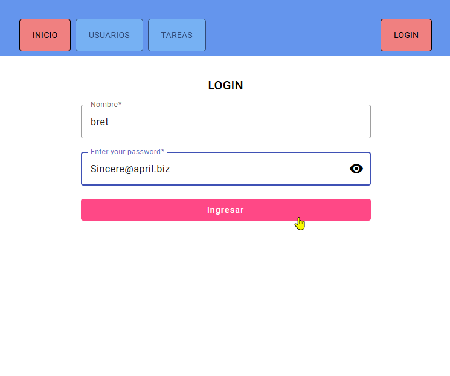
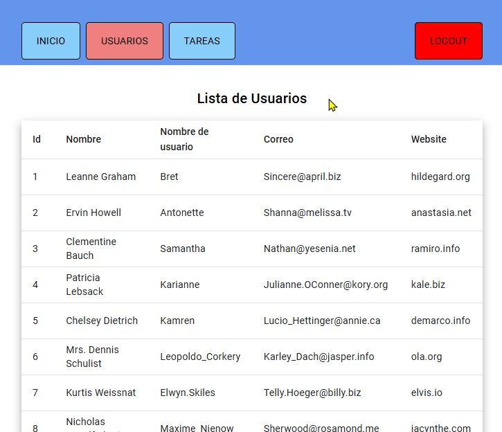
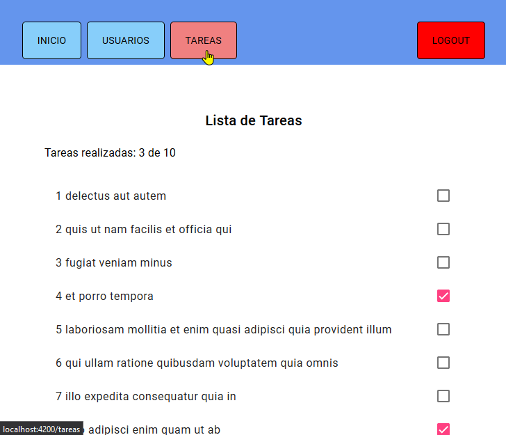
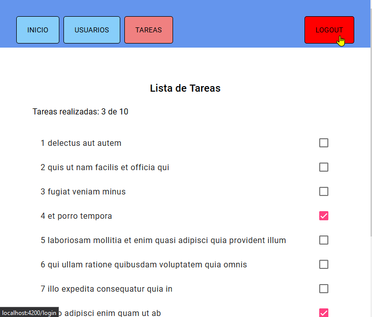
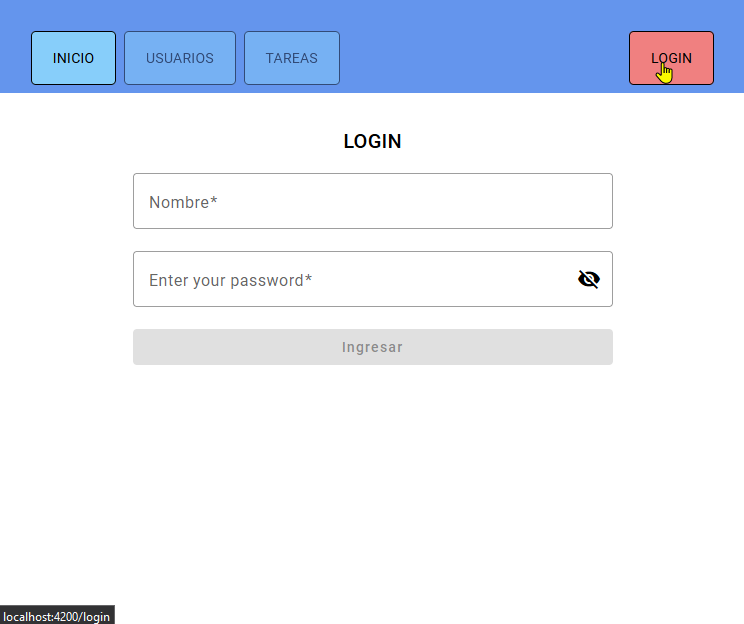

# Materialb








30/01/23 notas:
test unitarios
test de integracion
test de extremo a extremo(e2e, end to end)
karma (viene integrada en angular, para ejecutar gestionar pruebas realizadas con jazmin)

ng add @angular/material

prueba de creacion, viene por defecto


en form.component.spec.ts:

it ('probando funcion saludo()', ()=>{
expect(component.Saludo()).toequal('hola')
})

it ('probando funcion sumar', ()=>{
expect(component.Sumar(2+3)).toequal(5)
})


### Cómo hacer tests en Angular?

https://www.cloudhadoop.com/angular-run-single-testfile/

```
ng test --include=**/form.component.spec.ts
```

o crear unscript en angular.json que ejecute el mismo codigo


### cómo evitar que karma abra chrome

ng generate config karma (no funciona)
karma init... (tampoco)

```
"tsConfig": "tsconfig.spec.json",
"karmaConfig": "karma.conf.js",
```

...datamuse+
<!-- https://www.datamuse.com/api/ 

api.datamuse.com/

getWordsSimilarSound

getWordsSimilarSpell

getWordsRelated

- nouns
- adjectives
- synonyms
- associated
- antonyms
- hom sound-alike
- cns consonant match

max (number of results, default:100)

md r (pronuciation) -->
